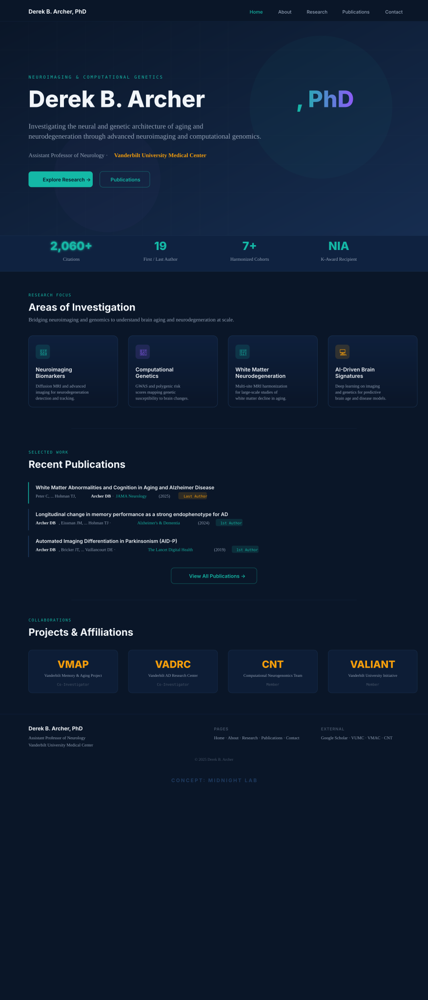
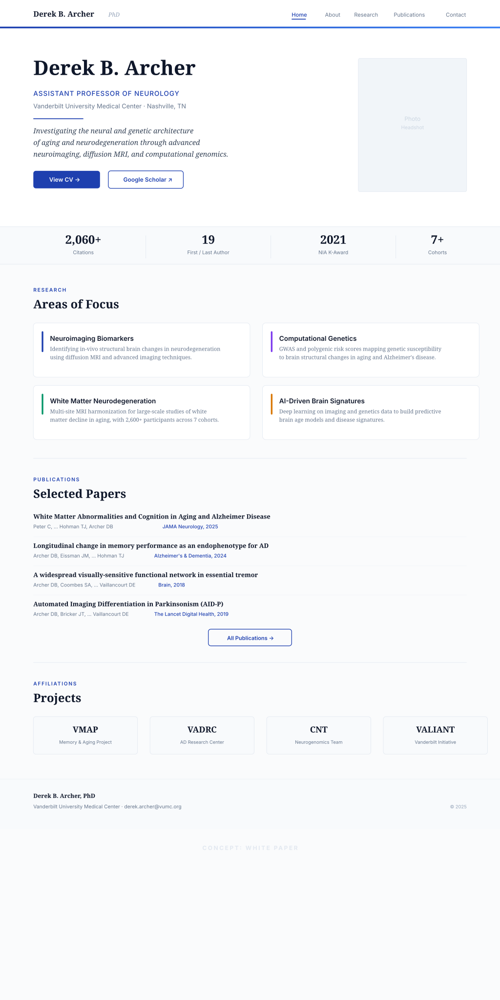
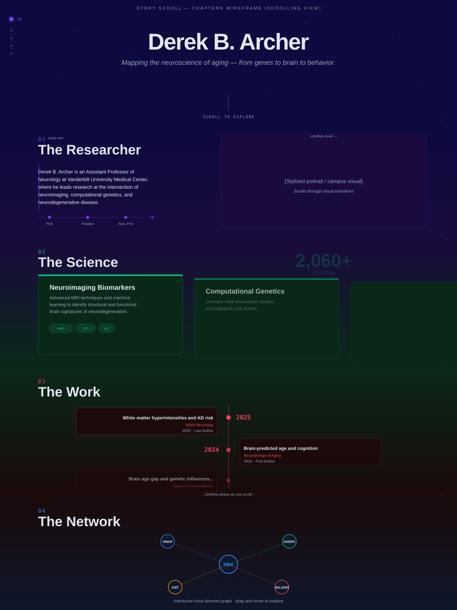
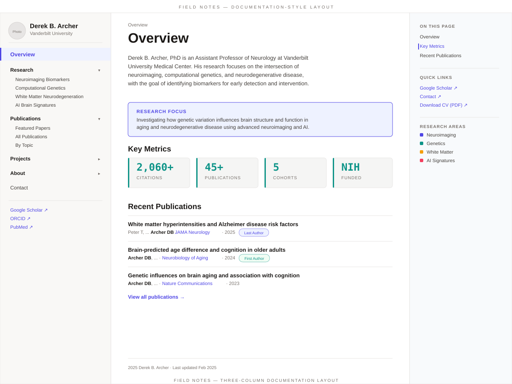

# Design Concepts for derekarcher.com

Six design directions for Derek Archer's academic website. These aren't just different color schemes — each concept takes a **structurally different approach** to organizing and presenting the same content.

Pick a favorite (or mix elements from multiple) and we'll build it out.

---

## Concepts at a Glance

| # | Concept | Structure | What's Different |
|---|---------|-----------|-----------------|
| 1 | [Midnight Lab](midnight-lab/midnight-lab.md) | Traditional hero + sections | Dark, glass-morphism, grid background, lab-at-night feel |
| 2 | [White Paper](white-paper/white-paper.md) | Traditional hero + sections | Light, serif-forward, journal-inspired, generous whitespace |
| 3 | [Neural Net](neural-net/neural-net.md) | Traditional hero + sections | Gradient system, network graph as hero art, monogram branding |
| 4 | [Bento Board](bento-board/bento-board.md) | Dashboard tile grid | **No hero** — entire homepage is a mosaic of tiles, dashboard KPI aesthetic |
| 5 | [Story Scroll](story-scroll/story-scroll.md) | Single-page scrollytelling | **No nav bar** — content unfolds in full-screen chapters as you scroll |
| 6 | [Field Notes](field-notes/field-notes.md) | Three-column docs layout | **Sidebar navigation** — deep, docs-style, reading-optimized |

---

## Previews

### 1. Midnight Lab
> Dark, immersive, data-forward. The kind of site a researcher builds when their work *is* the aesthetic.

---

### 2. White Paper
> An elegantly typeset journal article — the research speaks for itself.

---

### 3. Neural Net
> The research *is* the design — interconnected, dynamic, alive.

---

### 4. Bento Board
> Everything at a glance — a mosaic of research, publications, and impact.

---

### 5. Story Scroll
> A research career told as a visual narrative — scroll to unfold.

---

### 6. Field Notes
> A researcher's notebook — organized, searchable, always open on the desk.

