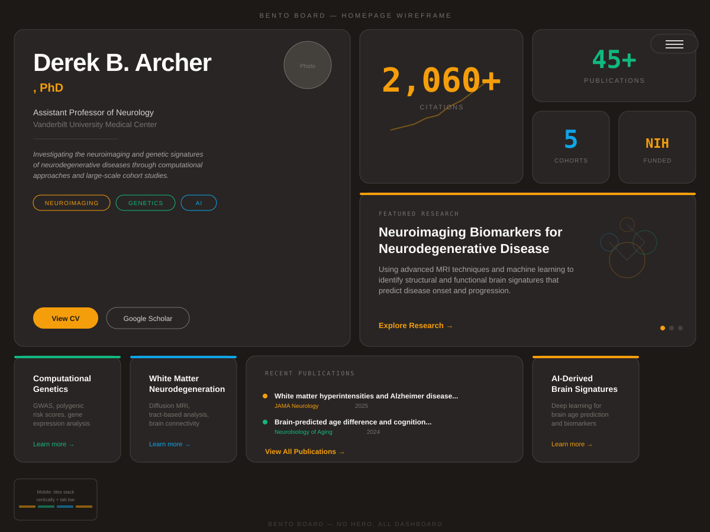

# Bento Board

> Everything at a glance — a mosaic of research, publications, and impact.



---

## Vibe
Dashboard-first. No hero section, no scroll to find things. The entire homepage is a grid of tiles — like a Notion workspace or an Apple keynote slide. Each tile is a self-contained module: one for the bio, one for each metric, one for each research area, one for recent papers. Think: a mission control screen for a research career.

## Color Palette

| Role | Color | Hex |
|------|-------|-----|
| Background | Warm charcoal | `#1c1917` |
| Tile surface | Stone dark | `#292524` |
| Tile border | Stone mid | `#44403c` |
| Primary accent | Amber | `#f59e0b` |
| Secondary accent | Emerald | `#10b981` |
| Tertiary accent | Sky | `#0ea5e9` |
| Heading text | Stone light | `#fafaf9` |
| Body text | Stone 300 | `#d6d3d1` |
| Muted text | Stone 500 | `#78716c` |

Warm tones differentiate this from the cool-blue academic norm. The amber/emerald/sky accents feel like status indicators on a dashboard.

## Typography
- **Headings:** Space Grotesk — geometric, techy, distinctive character
- **Body:** Inter — clean readability
- **Data/Numbers:** Space Mono — monospace for metrics, giving them a data-readout feel

## Page Structure

This is the key differentiator: **there is no hero section**. The homepage is a single viewport-height grid (with overflow scroll on mobile). Content is organized spatially, not sequentially.

### The Grid (Desktop: 4 columns x 3 rows)

```
┌──────────────┬──────┬──────┬──────────────┐
│              │ 2060+│  45+ │              │
│  NAME &      │ cita-│ pub- │  FEATURED    │
│  BIO TILE    │ tions│ lica-│  RESEARCH    │
│  (2x2)       │      │ tions│  AREA        │
│              ├──────┼──────┤  (2x2)       │
│              │  5   │ NIH  │              │
│              │cohort│funded│              │
├──────┬───────┼──────┴──────┼──────┬───────┤
│ Area │ Area  │   RECENT    │ Area │ Collab│
│  1   │  2    │   PAPERS    │  3   │ Net-  │
│      │       │   (2x1)     │      │ work  │
└──────┴───────┴─────────────┴──────┴───────┘
```

### Tile Types

#### Identity Tile (Large, top-left)
- Takes up 2 columns, 2 rows
- Name in large Space Grotesk (48px)
- "PhD" in amber accent
- Title and affiliation below
- 2-line research summary
- Small headshot circle in the corner
- Two pill buttons at the bottom: "View CV" and "Google Scholar"
- No background image — clean, typographic

#### Metric Tiles (Small, 1x1 each)
- Four individual tiles, each with a single large number
- Number in Space Mono, colored by accent (amber, emerald, sky, amber)
- Label in muted text below
- Feel like dashboard KPI widgets
- Subtle animated count-up on page load

#### Featured Research Tile (Large, top-right)
- 2 columns, 2 rows
- Shows the primary research area with a brief description
- Abstract SVG illustration (brain network diagram, stylized)
- "Explore Research →" link in accent color
- This tile rotates/cycles through research areas with a subtle crossfade

#### Research Area Tiles (Small, 1x1 each)
- Three tiles for the other research areas
- Each has a thin colored top border matching its theme
- Title in white, 1-line description in muted text
- Hover: tile lifts slightly, border glows

#### Recent Papers Tile (Wide, 2x1)
- Shows 2-3 most recent publications in a compact list
- Title truncated with ellipsis, journal in accent color, year
- "View All Publications →" at the bottom
- Scrollable if more than 3 papers

#### Collaboration Tile (Small, 1x1)
- Shows a miniature network diagram with project acronyms
- Nodes glow in different accent colors
- "Explore Network →" link
- This becomes the full interactive graph on the collaborations page

### Navigation
- **No traditional header/nav bar**
- Instead, a floating pill in the top-right corner with a hamburger icon
- Clicking it opens a full-screen overlay with large nav links
- On the grid itself, tiles act as navigation — clicking a research tile goes to the research page, clicking the papers tile goes to publications
- The grid IS the navigation

### Mobile Layout
- Tiles stack vertically in a single column
- Identity tile spans full width
- Metric tiles become a 2x2 mini-grid
- Everything else stacks
- A fixed bottom tab bar appears for navigation (replacing the floating pill)

### Sub-pages
- Sub-pages (Research, Publications, About, Contact) use a more traditional scrolling layout
- But they inherit the tile aesthetic: content is in cards/tiles, not free-flowing text
- A "Back to Board" button returns to the grid homepage

## What Makes This Design Distinctive
- **No hero section** — the grid IS the first impression. No scrolling needed to get an overview.
- **Spatial organization** — content is arranged by importance/size, not chronological scroll order. The eye can jump to what interests it.
- **Dashboard aesthetic** — feels like looking at a researcher's control panel, not reading their resume.
- **Tiles as navigation** — each tile is clickable, making the homepage a visual site map.
- **Warm palette** — charcoal/amber/emerald instead of the typical cool blues and navies. Feels approachable despite being data-forward.
- **No traditional nav bar** — the floating pill + tile-based navigation is unconventional and memorable.
- **Metric widgets** — treating citation counts like KPI cards reinforces the data-driven identity.
- **Space Grotesk** — a distinctive typeface that immediately sets this apart from the Inter/Roboto norm.
