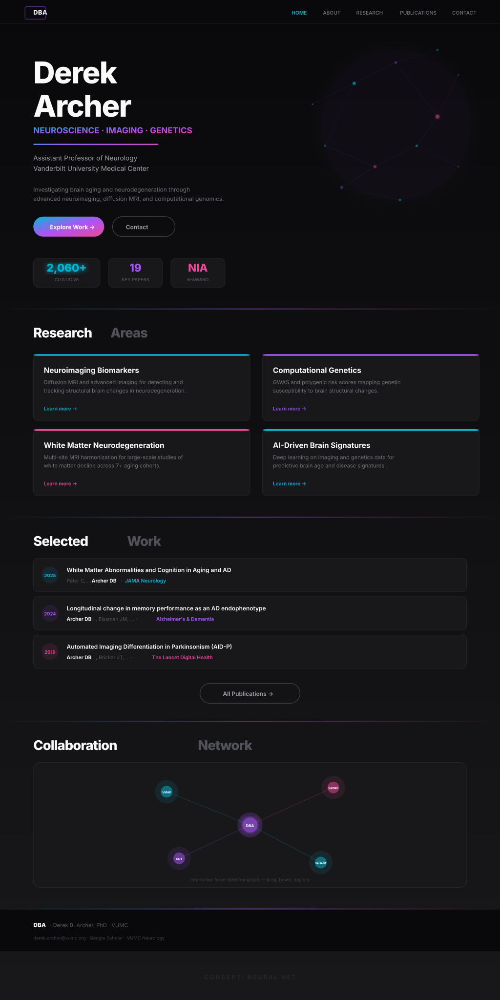

# Neural Net

> The research *is* the design — interconnected, dynamic, alive.

---

## Vibe
Bold, modern, unapologetically technical. The network graph motif appears literally in the hero background and the collaboration section, but it also shapes the design philosophy: everything is a *node* connected to everything else. Year-markers are circles. Cards have glowing top borders. The palette uses cyan-purple-pink gradients that feel like neural activation maps. Think: if a Nature paper's supplemental data visualization became a website.

## Color Palette

| Role | Color | Hex |
|------|-------|-----|
| Background | True black | `#09090b` |
| Surface | Near-black | `#18181b` |
| Border | Dark zinc | `#27272a` |
| Accent 1 | Cyan | `#06b6d4` |
| Accent 2 | Purple | `#a855f7` |
| Accent 3 | Pink | `#ec4899` |
| Heading text | White | `#fafafa` |
| Body text | Light zinc | `#a1a1aa` |
| Muted text | Dark zinc | `#71717a` |
| Dim text | Darkest zinc | `#52525b` |

The three accent colors are used as a gradient across the site and also individually to color-code different sections and time periods.

## Typography
- **Everything is Inter** — one typeface, used at different weights (400-800) and sizes to create hierarchy. No serif, no code font. The weight contrast does all the work.
- **Tight letter-spacing** on large headings (`-2px`) gives them a modern, compressed feel
- **All-caps** for nav and labels, creating a structured, systematic look

## Page Elements

### Header
- Black, nearly invisible — just a thin bottom border
- "DBA" monogram in a bordered pill on the left (not full name — this is a *brand*)
- All-caps nav links, active one in cyan
- Ultra-minimal

### Hero Section
- Name split across two lines in massive Inter Black (72px)
- Below the name: three keywords in gradient text — "NEUROSCIENCE · IMAGING · GENETICS"
- A gradient bar (cyan → purple → pink) as a bold visual divider
- Title and affiliation in muted text below
- Research summary in dim text — deliberately de-emphasized, the name and keywords do the talking
- Pill-shaped CTA buttons — one gradient-filled, one outlined
- **Background: actual network graph** with glowing nodes and thin connecting edges in the right portion of the hero. This is cosmetic here but becomes interactive on the research page.

### Metrics
- Three floating pill/chip cards instead of a full-width banner
- Each has a single large number in a different accent color (cyan, purple, pink)
- All-caps labels below in dim text
- Feel like dashboard widgets

### Research Areas
- Two-word section headings: first word white, second word dim gray — e.g., "Research Areas", "Selected Work"
- Gradient horizontal rule as section divider
- 2x2 grid of dark cards with a colored top border (4px, matching the card's theme)
- Each card has "Learn more →" link in the card's accent color
- Cards are dark surfaces on a dark background — differentiated only by the colored border and subtle zinc outline

### Publications
- Each paper is a full-width dark card
- Year displayed in a colored circle on the left (different accent colors for different decades/periods)
- Title and metadata on the right
- Journal name in the corresponding accent color
- No author position badges — the bold treatment on "Archer DB" communicates authorship

### Collaboration Network
- This is the signature element of this concept
- A full-width card containing a **force-directed network graph preview**
- Central "DBA" node with project nodes (VMAP, VADRC, CNT, VALIANT) connected by colored edges
- Each node has a glow effect
- Labeled "Interactive force-directed graph — drag, hover, explore"
- This becomes fully interactive on the actual site

### Footer
- Single line: monogram, name, affiliation, links
- Gradient horizontal rule above
- Minimal — just utility

## What Makes This Design Distinctive
- **Three-color gradient system** (cyan/purple/pink) — instantly recognizable, feels like neuroimaging activation maps
- **Network graph as hero art** — the hero background isn't a stock photo or abstract gradient; it's a network visualization. This is *his research* becoming *his design*.
- **Monogram branding** — "DBA" instead of full name in the header. Treats the researcher as a brand.
- **Pill-shaped buttons and metric chips** — rounded elements everywhere give a modern, app-like feel
- **Two-tone section headings** — "Selected Work" with "Selected" in white and "Work" in gray. Adds rhythm without being fussy.
- **Year circles** in publications — color-coded by era, making the timeline progression visible at a glance
- **Interactive collaboration graph** — the most ambitious interactive element, placed prominently as its own section rather than buried in a sidebar
- **Single typeface** — Inter does everything. The constraint is the point.
